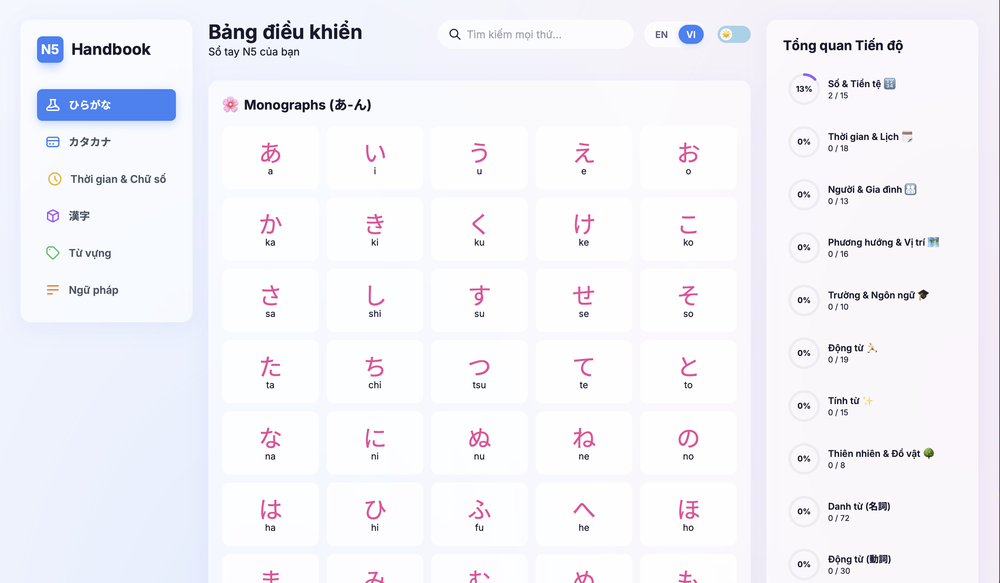
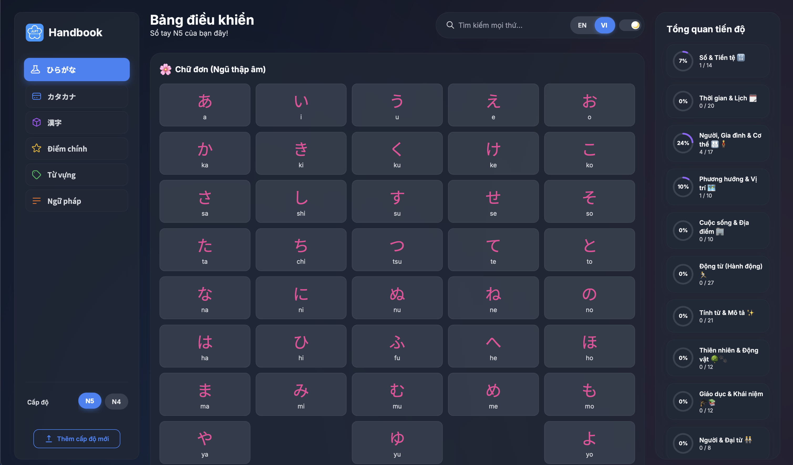

# 🇯🇵 JLPT N5 Handbook

> A simple, interactive web application designed to help you study for the **JLPT N5** exam. Features comprehensive study materials, a progress tracker, and a **bilingual interface (English/Vietnamese)**, all in a single, fast-loading page.

---

**🚀 [View the Live Demo](https://ghuyphan.github.io/n5-handbook/) 🚀**

---

### Light & Dark Mode Preview

| Light Mode | Dark Mode |
| :---: | :---: |
|  |  |

## ✨ Features

This application is packed with features to make your study session as effective as possible:

* **🌐 Bilingual Interface (EN/VI):** Instantly switch the entire user interface, including flashcard meanings and grammar notes, between **English** and **Vietnamese**. Your language preference is saved locally for your next visit.
* **📚 Comprehensive Content:** Covers all essential N5 topics:
    * **🌸 Hiragana & 🤖 Katakana Charts:** Interactive and easy-to-read charts for mastering the basic Japanese alphabets.
    * **🗓️ Time & Numbers:** Detailed tables for numbers, counters, days of the week, and months.
    * **🗂️ Interactive Flashcards:** For `Kanji` and `Vocabulary`, categorized for focused learning. Just click to flip and reveal the answer.
    * **📖 Collapsible Grammar Notes:** All essential N5 `Grammar` points are neatly organized. Click to expand and read the details.
* **📊 Progress Tracking:** Mark Kanji and Vocabulary as "learned" and see your progress for each category in the real-time overview dashboard.
* **🎨 Dual Themes:** Switch between a clean **Light Mode** and a sleek **Dark Mode**. The theme and language toggles are grouped into a unified control pod for a modern look.
* **🔍 Universal Search:** Instantly filter content across all sections using the search bar.
* **✅ Self-Contained & Fast:** Built as a single HTML file, it loads instantly with no backend or dependencies required.
* **📱 Fully Responsive:** Study on your desktop, tablet, or phone. The layout adapts to any screen size, featuring a polished mobile sidebar with centered, single-line navigation items.

## 🛠️ How to Use

Getting started is easy:

1.  **Navigate:** Use the sidebar menu to switch between **Hiragana**, **Katakana**, **Time & Numbers**, **Kanji**, **Vocabulary**, and **Grammar**.
2.  **Interact:**
    * Click on **flashcards** to flip them.
    * Click the **checkmark icon** on a card to mark it as "learned" and update your progress.
    * Click on **section titles** (like in Grammar or Kanji) to expand or collapse them.
3.  **Track Progress:** The **Progress Overview** on the desktop sidebar shows what you've learned at a glance. Click on any category to jump directly to it.
4.  **Switch Language:** Use the **EN/VI** toggle in the header (or mobile sidebar) to change the language.
5.  **Switch Theme:** Use the ☀️/🌙 toggle in the same control group to switch between light and dark modes.

## 💻 Built With

* **HTML5**
* **Tailwind CSS** (via CDN) - For utility-first styling.
* **Vanilla JavaScript** - For all the interactive logic, data rendering, and state management.

## 🌐 Deployment

This project is hosted on **GitHub Pages**.

To deploy your own version, simply upload the `index.html` file to a GitHub repository and enable GitHub Pages in the repository's settings (`Settings` > `Pages`). No build process is needed.