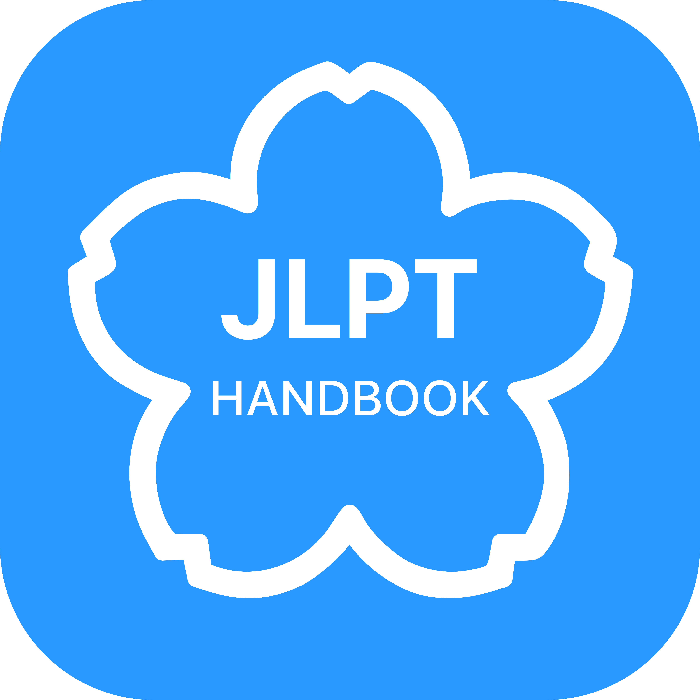

<p align="center">
  
</p>
<h1 align="center">Japanese Language Handbook</h1>

> An interactive, multi-level web application to help you study Japanese. Start with the built-in **JLPT N5** material or **import your own custom study levels**. Features comprehensive study materials, per-level progress tracking, advanced fuzzy search, and a bilingual interface (English/Vietnamese).

-----

**🚀 [View the Live Demo](https://ghuyphan.github.io/n5-handbook/) 🚀**

-----

### Light & Dark Mode Preview

| Light Mode                                   | Dark Mode                                   |
| :------------------------------------------- | :------------------------------------------ |
|  |  |

## ✨ Features

This application has been rebuilt to be a flexible and powerful study tool.

- **🗂️ Multi-Level System:**
  - Comes pre-loaded with a complete **JLPT N5** handbook.
  - Instantly switch between the default level and any custom levels you've imported.
  - Easily delete custom levels you no longer need with a dedicated button that appears right in the level switcher.
- **⬆️ Import Custom Levels:**
  - Create your own study sets using a simple **CSV file structure**.
  - Use the in-app import tool to add new levels (e.g., N4, N3, or specialized vocabulary lists).
  - Imported levels are stored locally in your browser, so they're always available to you.
- **💾 Persistent Local Data:**
  - The app uses **IndexedDB** to save all your data in the browser—no backend needed.
  - Progress (learned Kanji/Vocab) is saved **per level**.
  - Your preferred theme, language, current level, and pinned tab are remembered for your next visit.
- **📌 Pin Your Favorite Tab:**
  - Set any main content tab (like *Kanji*, *Vocab*, or *Grammar*) as your default.
  - The app will automatically open your pinned tab on launch.
  - **On Desktop:** Pin or unpin any tab directly from the sidebar for quick workflow changes.
  - **On Mobile:** A dedicated pin icon in the header allows you to quickly pin the current view.
- **🔍 Advanced Fuzzy Search:**
  - Instantly filter content within any tab using the search bar.
  - Powered by **Fuse.js** for intelligent, typo-tolerant searching.
  - Integrated with **Wanakana.js**, so you can search in English, Romaji, Hiragana, or Katakana, and it will find the right content.
- **📊 Real-Time Progress Dashboard:**
  - Mark Kanji and Vocabulary as "learned" with a single click on a card.
  - The dashboard gives a visual overview of your mastery for each category within the current level.
  - Click any category in the dashboard to jump directly to that section for quick review.
- **📖 Detail Kanji Modal:**
  - Click on a Kanji card to open a detailed modal with more information.
  - The modal includes examples, mnemonic, radical, and a sentence with furigana.
- **🌐 Bilingual Interface (EN/VI):**
  - Instantly switch the entire UI between **English** and **Vietnamese**.
  - Language preference is saved for your next session.
- **🎨 Dual Themes & Responsive Design:**
  - Choose between a clean **Light Mode** and a sleek **Dark Mode**.
  - The layout is fully responsive, offering a polished experience on desktop, tablet, and mobile, complete with a slide-in sidebar.

## 🛠️ How to Create and Import a Custom Level

You can extend the handbook by creating your own levels.

1.  **Prepare Your Data Files:**
    Create a folder for your new level (e.g., `my-n4-level`). Inside, create **CSV** files for the content you want to add. Supported filenames are:
    - `hiragana.csv`
    - `katakana.csv`
    - `kanji.csv`
    - `vocab.csv`
    - `grammar.csv`
    - `keyPoints.csv`

    You don't need to include all files—only the ones for the content you're adding. See the "CSV File Structure Guide" section below for detailed column requirements.

2.  **Use the Import Tool:**
    - Open the handbook application.
    - Open the sidebar (click the `☰` icon on mobile).
    - Click the **"Import New Level"** button.
    - In the modal window that appears:
      - Enter a unique, simple name for your level (e.g., `n4`, `business-vocab`). This name cannot already exist.
      - Drag-and-drop your CSV files onto the designated area, or click to open a file selector.
    - Click **"Import Level"**. The app will save your new level to the browser's database and switch to it automatically.

## 📝 CSV File Structure Guide

Each CSV file **must** include a header row with the exact column names specified below. The importer is case-sensitive and requires these exact names to work.

> **Important:** If any of your content (like an explanation or example sentence) contains a comma, you **must** wrap that entire piece of content in double quotes (`"`). This ensures the file is parsed correctly.
>
> **Example:** `"<b>Example:</b> 週末、映画を見に行こう。"`

### Hiragana & Katakana (`hiragana.csv` / `katakana.csv`)
| kana | romaji |
|------|--------|
| あ   | a      |
| い   | i      |
| う   | u      |
| え   | e      |
| お   | o      |

- **kana:** The Hiragana or Katakana character(s).
- **romaji:** The Romaji equivalent.

### Kanji (`kanji.csv`)
| kanji | onyomi | kunyomi | meaning_en | meaning_vi | radical_en | radical_vi | mnemonic_en | mnemonic_vi |
|-------|--------|---------|------------|------------|------------|------------|-------------|-------------|
| 日    | ニチ   | ひ      | day; sun   | ngày; mặt trời | Sun        | Mặt trời   | A sun has a single, long ray going down. | Mặt trời có một tia sáng dài chiếu xuống. |
| 一    | イチ   | ひと    | one        | một        | One        | Một        | A single stroke, representing unity or one. | Một nét đơn, tượng trưng cho sự thống nhất hoặc số một. |
| 人    | ジン   | ひと    | person; people | người; con người | Person     | Người      | A person standing on two legs. | Một người đứng trên hai chân. |

- **kanji:** The Kanji character.
- **onyomi:** The On'yomi reading (Katakana/Romaji).
- **kunyomi:** The Kun'yomi reading (Hiragana/Romaji).
- **meaning_en:** English meaning.
- **meaning_vi:** Vietnamese meaning.
- **radical_en:** English radical information.
- **radical_vi:** Vietnamese radical information.
- **mnemonic_en:** English mnemonic (memory aid).
- **mnemonic_vi:** Vietnamese mnemonic (memory aid).

> **Note:** Examples and sentence data are *not* currently supported for import via CSV for Kanji cards.

### Vocabulary (`vocab.csv`)
| word | reading | meaning_en | meaning_vi |
|------|---------|------------|------------|
| これ | これ    | this      | cái này   |
| それ | それ    | that      | cái đó    |
| あれ | あれ    | that (over there) | cái kia |

- **word:** The Japanese vocabulary word (Kanji/Kana).
- **reading:** The reading in Hiragana.
- **meaning_en:** The English meaning.
- **meaning_vi:** The Vietnamese meaning.

### Grammar (`grammar.csv`)
| title_en       | content_en                                                               | title_vi     | content_vi                                                  |
|----------------|--------------------------------------------------------------------------|--------------|-------------------------------------------------------------|
| Particle は    | "Used to mark the topic of a sentence. It indicates what you are talking about." | Trợ từ は    | "Dùng để đánh dấu chủ đề của câu. Nó cho biết bạn đang nói về cái gì." |
| Particle の    | "Indicates possession or modifies a noun."                                 | Trợ từ の    | "Chỉ sự sở hữu hoặc bổ nghĩa cho danh từ."                     |
| Verb ます-form | "Used for polite present/future affirmative verbs."                        | Động từ thể ます | "Dùng cho động từ khẳng định ở thì hiện tại/tương lai lịch sự." |

- **title_en:** The English title of the grammar point.
- **content_en:** The English explanation/examples (supports HTML).
- **title_vi:** The Vietnamese title of the grammar point.
- **content_vi:** The Vietnamese explanation/examples (supports HTML).

### Key Points (`keyPoints.csv`)
| character | reading | meaning_en | meaning_vi | number |
|-----------|---------|------------|------------|--------|
| 上         | うえ    | up; above  | trên       |        |
| 下         | した    | down; below| dưới      |        |
| 左         | ひだり  | left       | trái       |        |
| 右         | みぎ    | right      | phải       |        |
| 千         | せん    | thousand   | ngàn       | 1000   |

- **character:** The Kanji or Kana character (optional).
- **reading:** The reading in Kana/Romaji.
- **meaning_en:** The English translation.
- **meaning_vi:** The Vietnamese translation.
- **number:** The related number (optional).

> **Note:** Imported keyPoints will always display as a simple list, even if the original data had a table-grid structure.

## 💻 Setting Up Locally

To run the project locally, you need to have **Node.js** and **npm** installed.

1.  **Clone the repository:**
    ```bash
    git clone https://github.com/ghuyphan/n5-handbook.git
    cd n5-handbook
    ```
2.  **Install dependencies:**
    ```bash
    npm install
    ```
3.  **Run the development server:**
    ```bash
    npm run watch
    ```
    This command will watch for changes in your CSS files and recompile them automatically.

4.  **Open with Live Server:**
    - Install the [Live Server](https://marketplace.visualstudio.com/items?itemName=ritwickdey.LiveServer) extension in VS Code.
    - Right-click `index.html` → "Open with Live Server".

## 🔧 Built With

- **HTML5** & **CSS3**
- **Vanilla JavaScript (ESM)**
- **Tailwind CSS**
- **JSON**

### Libraries
- [idb](https://github.com/jakearchibald/idb) - A promise-based wrapper for IndexedDB.
- [Fuse.js](https://fusejs.io/) - A powerful, lightweight fuzzy-search library.
- [Wanakana](https://wanakana.com/) - A utility library for Japanese character conversion.

## 🌐 Deployment
To create a production-ready build of the CSS:
```bash
npm run build