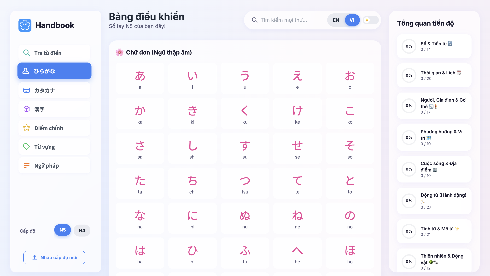

<p align="center">
  
</p>

<h1 align="center">JLPT Handbook</h1>

<p align="center">
  Your personal, interactive space to master Japanese. Dive into built-in JLPT N5 & N4 materials, or bring your own study lists by importing custom levels!
</p>

<p align="center">
  <a href="https://github.com/ghuyphan/n5-handbook/actions/workflows/jekyll-docker.yml" target="_blank">
    
  </a>
  <a href="https://github.com/ghuyphan/n5-handbook/blob/main/package.json" target="_blank">
    
  </a>
</p>

<p align="center">
  <b><a href="https://ghuyphan.github.io/n5-handbook/" target="_blank">🚀 View the Live App 🚀</a></b>
</p>

<p align="center">
  
  
</p>

---

### ✨ Cool Features

* **🗂️ Multiple Levels**: Switch between JLPT N5, N4, and your own custom-made levels.
* **⬆️ Import Your Own Decks**: Got a spreadsheet of vocab? Turn it into a study level!
* **💾 Saves Your Progress**: Your learned items are saved right in your browser. No account needed.
* **🌐 Bilingual Interface**: Toggle between English and Vietnamese instantly.
* **🔍 Smart Search**: Quickly find any grammar point, word, or kanji.
* **📖 Built-in Dictionary**: Look up words on the fly without leaving the app.
* **💡 Detailed Kanji Info**: See kanji examples, mnemonics, and sentence breakdowns in a flash.
* **📊 Progress Dashboard**: Visualize your study progress and stay motivated.
* **📌 Pin Your Favorite Tab**: Keep your most-used section just a click away.
* **🔗 Shareable Links**: Bookmark or share specific levels and tabs instantly.
* **📝 Take Notes**: Jot down personal mnemonics or reminders for any topic.
* **🎨 Light & Dark Modes**: Study comfortably, day or night.
* **⚡️ Offline Ready**: Access content and continue studying even without an internet connection.
* **📱 Installable App**: Add to your home screen for quick access and a native app-like experience.

---

### 🛠️ Tech Stack

<p align="center">           </p>

---

### 🚀 How to Create & Import Your Own Study Level

Got your own study material? Awesome! Follow these simple steps to add it to the app.

1.  **Get Your Files Ready 📁**

    * You'll need your data in **CSV (Comma-Separated Values)** format. You can create this with Google Sheets, Excel, or any spreadsheet software.
    * The app will automatically detect if your file uses **commas (`,`)** or **semicolons (`;`)** as separators.
    * If any of your text contains the separator character, be sure to wrap that text in **double quotes (`"`)**.
    * Name your files exactly as listed below so the app knows what's inside:
        * `hiragana.csv`
        * `katakana.csv`
        * `kanji.csv`
        * `vocab.csv`
        * `grammar.csv`
        * `keyPoints.csv`

2.  **Import into the App 🚀**

    * In the app, open the sidebar and click **"Import New Level"**.
    * Give your new level a unique name (e.g., "n3-vocab", "my-kanji-list"). Use only lowercase letters, numbers, and hyphens.
    * Drag and drop your CSV files into the upload area.
    * Click **"Import Level"** and you're all set!

---

### 📝 How to Structure Your CSV Files

This is the most important part! To make sure your files import correctly, you need to use the exact column headers shown below.

<br>

<details>
<summary><strong>🇬🇧 English Guide (Click to Open)</strong></summary>

> **Heads up!** For any column that has translations, make sure the header ends with **`_en`** for English and **`_vi`** for Vietnamese.

#### **Kanji (`kanji.csv`)**

| kanji | onyomi | kunyomi | meaning\_en | meaning\_vi | radical\_en | radical\_vi | mnemonic\_en | mnemonic\_vi |
| :-- | :-- | :-- | :-- | :-- | :-- | :-- | :-- | :-- |
| 水 | スイ | みず | water | nước | Water | Nước | Water droplets | Giọt nước |

> **Note:** The app doesn't support importing kanji examples or sentences from CSV at this time.

#### **Vocabulary (`vocab.csv`)**

| word | reading | meaning\_en | meaning\_vi |
| :-- | :-- | :-- | :-- |
| 猫 | ねこ | cat | con mèo |
| 犬 | いぬ | dog | con chó |

#### **Grammar (`grammar.csv`)**

| title\_en | title\_vi | content\_en | content\_vi |
| :-- | :-- | :-- | :-- |
| About X | Về X | This pattern is used to... | Mẫu này được dùng để... |
| Because of Y | Bởi vì Y | The reason for this is... | Lý do cho việc này là... |

#### **Hiragana/Katakana (`.csv`)**

| kana | romaji |
| :-- | :-- |
| あ | a |
| い | i |

#### **Key Points (`keyPoints.csv`)**

| Kanji | Reading | en | vi |
| :-- | :-- | :-- | :-- |
| 上 | うえ | up | trên |
| 下 | した | down | dưới |

</details>

<br>

<details>
<summary><strong>🇻🇳 Hướng dẫn Tiếng Việt (Nhấn để Mở)</strong></summary>

> **Lưu ý!** Đối với bất kỳ cột nào có bản dịch, hãy đảm bảo tiêu đề cột kết thúc bằng **`_en`** cho tiếng Anh và **`_vi`** cho tiếng Việt.

#### **Kanji (`kanji.csv`)**

| kanji | onyomi | kunyomi | meaning\_en | meaning\_vi | radical\_en | radical\_vi | mnemonic\_en | mnemonic\_vi |
| :-- | :-- | :-- | :-- | :-- | :-- | :-- | :-- | :-- |
| 水 | スイ | みず | water | nước | Water | Nước | Water droplets | Giọt nước |

> **Lưu ý:** Hiện tại, ứng dụng không hỗ trợ nhập ví dụ hoặc câu kanji từ tệp CSV.

#### **Từ vựng (`vocab.csv`)**

| word | reading | meaning\_en | meaning\_vi |
| :-- | :-- | :-- | :-- |
| 猫 | ねこ | cat | con mèo |
| 犬 | いぬ | dog | con chó |

#### **Ngữ pháp (`grammar.csv`)**

| title\_en | title\_vi | content\_en | content\_vi |
| :-- | :-- | :-- | :-- |
| About X | Về X | This pattern is used to... | Mẫu này được dùng để... |
| Because of Y | Bởi vì Y | The reason for this is... | Lý do cho việc này là... |

#### **Hiragana/Katakana (`.csv`)**

| kana | romaji |
| :-- | :-- |
| あ | a |
| い | i |

#### **Điểm chính (`keyPoints.csv`)**

| Kanji | Reading | en | vi |
| :-- | :-- | :-- | :-- |
| 上 | うえ | up | trên |
| 下 | した | down | dưới |

</details>

---

### 💻 Setting Up Locally

Want to run the project on your own machine?

```bash
# Clone the repository
git clone https://github.com/ghuyphan/n5-handbook.git

# Go into the project folder
cd n5-handbook

# Install dependencies
npm install

# Start the development server with hot reload
npm run dev

# Build for production
npm run build

# Preview the production build
npm run preview
```

---

### 🙏 Acknowledgements

* Dictionary data from [Jotoba](https://jotoba.de/) and [Mazii](https://mazii.net/).
* Icons and logos from [Devicon](https://devicon.dev/) and other respective owners.