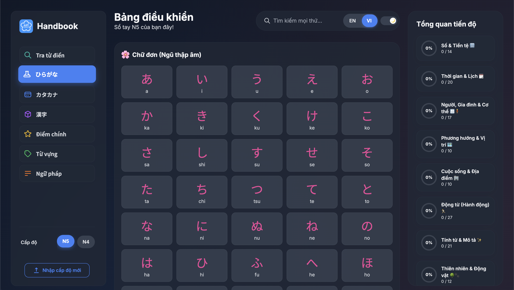

<p align="center">
  
</p>
<h1 align="center">Japanese Language Handbook</h1>

> An interactive, multi-level web application to help you study Japanese. Start with the built-in **JLPT N5** material or **import your own custom study levels**. Features comprehensive study materials, per-level progress tracking, advanced fuzzy search, and a bilingual interface (English/Vietnamese).

-----

**🚀 [View the Live Demo](https://ghuyphan.github.io/n5-handbook/) 🚀**

-----

### Light & Dark Mode Preview

| Light Mode                                   | Dark Mode                                   |
| :------------------------------------------- | :------------------------------------------ |
|  |  |

## ✨ Features

This application has been rebuilt to be a flexible and powerful study tool.

- **🗂️ Multi-Level System:**
  - Comes pre-loaded with a complete **JLPT N5** handbook.
  - Instantly switch between the default level and any custom levels you've imported.
  - Easily delete custom levels you no longer need with a dedicated button that appears right in the level switcher.
- **⬆️ Import Custom Levels:**
  - Create your own study sets using a simple **CSV file structure**.
  - Use the in-app import tool to add new levels (e.g., N4, N3, or specialized vocabulary lists).
  - Imported levels are stored locally in your browser, so they're always available to you.
- **💾 Persistent Local Data:**
  - The app uses **IndexedDB** to save all your data in the browser—no backend needed.
  - Progress (learned Kanji/Vocab) is saved **per level**.
  - Your preferred theme, language, current level, and pinned tab are remembered for your next visit.
- **📌 Pin Your Favorite Tab:**
  - Set any main content tab (like *Kanji*, *Vocab*, or *Grammar*) as your default.
  - The app will automatically open your pinned tab on launch.
  - **On Desktop:** Pin or unpin any tab directly from the sidebar for quick workflow changes.
  - **On Mobile:** A dedicated pin icon in the header allows you to quickly pin the current view.
- **🔍 Advanced Fuzzy Search:**
  - Instantly filter content within any tab using the search bar.
  - Powered by **Fuse.js** for intelligent, typo-tolerant searching.
  - Integrated with **Wanakana.js**, so you can search in English, Romaji, Hiragana, or Katakana, and it will find the right content.
- **📊 Real-Time Progress Dashboard:**
  - Mark Kanji and Vocabulary as "learned" with a single click on a card.
  - The dashboard gives a visual overview of your mastery for each category within the current level.
  - Click any category in the dashboard to jump directly to that section for quick review.
- **📖 Detail Kanji Modal:**
  - Click on a Kanji card to open a detailed modal with more information.
  - The modal includes examples, mnemonic, radical, and a sentence with furigana.
- **🌐 Bilingual Interface (EN/VI):**
  - Instantly switch the entire UI between **English** and **Vietnamese**.
  - Language preference is saved for your next session.
- **🎨 Dual Themes & Responsive Design:**
  - Choose between a clean **Light Mode** and a sleek **Dark Mode**.
  - The layout is fully responsive, offering a polished experience on desktop, tablet, and mobile, complete with a slide-in sidebar.

## 🛠️ How to Create and Import a Custom Level

You can extend the handbook by creating your own levels.

1.  **Prepare Your Data Files:**
    Create a folder for your new level (e.g., `my-n4-level`). Inside, create **CSV** files for the content you want to add. Supported filenames are:
    - `hiragana.csv`
    - `katakana.csv`
    - `kanji.csv`
    - `vocab.csv`
    - `grammar.csv`
    - `keyPoints.csv`

    You don't need to include all files—only the ones for the content you're adding. See the "CSV File Structure Guide" section below for detailed column requirements.

2.  **Use the Import Tool:**
    - Open the handbook application.
    - Open the sidebar (click the `☰` icon on mobile).
    - Click the **"Import New Level"** button.
    - In the modal window that appears:
      - Enter a unique, simple name for your level (e.g., `n4`, `business-vocab`). This name cannot already exist.
      - Drag-and-drop your CSV files onto the designated area, or click to open a file selector.
    - Click **"Import Level"**. The app will save your new level to the browser's database and switch to it automatically.

## 📝 CSV File Structure Guide

Each CSV file **must** include a header row with the exact column names specified below. Ensure values are comma-separated. The `id` column is internally generated for imported items, so you don't need to provide it in your CSV; however, other unique identifiers like Kanji characters or words should be treated as unique by you.

* **`hiragana.csv` / `katakana.csv`**
    ```csv
    kana,romaji
    あ,a
    い,i
    う,u
    え,e
    お,o
    か,ka
    ...
    ```
    -   `kana`: The Hiragana or Katakana character(s).
    -   `romaji`: The Romaji equivalent.

* **`kanji.csv`**
    ```csv
    kanji,onyomi,kunyomi,meaning_en,meaning_vi,radical_en,radical_vi,mnemonic_en,mnemonic_vi
    日,ニチ,ひ,day; sun,ngày; mặt trời,Sun,Mặt trời,A sun has a single, long ray going down.,Mặt trời có một tia sáng dài chiếu xuống.
    一,イチ,ひと,one,một,One,Một,A single stroke, representing unity or one.,Một nét đơn, tượng trưng cho sự thống nhất hoặc số một.
    人,ジン,ひと,person; people,người; con người,Person,Người,A person standing on two legs.,Một người đứng trên hai chân.
    ...
    ```
    -   `kanji`: The Kanji character.
    -   `onyomi`: The On'yomi reading (e.g., in Katakana or Romaji).
    -   `kunyomi`: The Kun'yomi reading (e.g., in Hiragana or Romaji).
    -   `meaning_en`: English meaning.
    -   `meaning_vi`: Vietnamese meaning.
    -   `radical_en`: English radical information/description.
    -   `radical_vi`: Vietnamese radical information/description.
    -   `mnemonic_en`: English mnemonic (memory aid).
    -   `mnemonic_vi`: Vietnamese mnemonic (memory aid).
    -   **Note:** Examples and sentence data are *not* imported via CSV for Kanji cards.

* **`vocab.csv`**
    ```csv
    word,reading,meaning_en,meaning_vi
    これ,これ,this,cái này
    それ,それ,that,cái đó
    あれ,あれ,that (over there),cái kia
    ...
    ```
    -   `word`: The Japanese vocabulary word (e.g., in Kanji or Kana).
    -   `reading`: The reading of the word (e.g., in Hiragana).
    -   `meaning_en`: English meaning.
    -   `meaning_vi`: Vietnamese meaning.

* **`grammar.csv`**
    ```csv
    en_title,en_content,vi_title,vi_content
    Particle は,Used to mark the topic of a sentence. It indicates what you are talking about.,Trợ từ は,Dùng để đánh dấu chủ đề của câu. Nó cho biết bạn đang nói về cái gì.
    Particle の,Indicates possession or modifies a noun.,Trợ từ の,Chỉ sự sở hữu hoặc bổ nghĩa cho danh từ.
    Verb ます-form,Used for polite present/future affirmative verbs.,Động từ thể ます,Dùng cho động từ khẳng định ở thì hiện tại/tương lai lịch sự.
    ...
    ```
    -   `en_title`: English title of the grammar point.
    -   `en_content`: English explanation and/or examples. HTML tags like `<br>` or `<b>` are supported.
    -   `vi_title`: Vietnamese title of the grammar point.
    -   `vi_content`: Vietnamese explanation and/or examples. HTML tags like `<br>` or `<b>` are supported.

* **`keyPoints.csv`**
    ```csv
    Kanji,Reading,vi,en,Number
    上,うえ,trên,up; above,
    下,した,dưới,down; below,
    左,ひだり,trái,left,
    右,みぎ,phải,right,
    千,せん,ngàn,thousand,1000
    ...
    ```
    -   `Kanji`: Kanji character (optional, but often used for key points).
    -   `Reading`: Reading in Kana or Romaji.
    -   `vi`: Vietnamese translation.
    -   `en`: English translation.
    -   `Number`: (Optional) A number related to the item, if applicable (e.g., for counters or specific numbers).
    -   **Note:** Imported `keyPoints` will always be displayed as a simple list (similar to the "table" type sections in the default N5 data), even if your original data had a more complex "table-grid" structure.

## 💻 Setting Up Locally

To run the project locally, you need to have **Node.js** and **npm** installed.

1.  **Clone the repository:**
    ```bash
    git clone [https://github.com/ghuyphan/n5-handbook.git](https://ghuyphan/n5-handbook.git)
    cd n5-handbook
    ```
2.  **Install dependencies:**
    ```bash
    npm install
    ```
3.  **Run the development server:**
    This command will start a local server and watch for any changes you make to the HTML, JS, or CSS files, automatically rebuilding the stylesheet.
    ```bash
    npm run watch
    ```
4.  **Open in your browser:**
    You will also need a local server to run the project. The easiest way is using the **Live Server** extension in VS Code:
    - Install the [Live Server](https://marketplace.visualstudio.com/items?itemName=ritwickdey.LiveServer) extension.
    - In VS Code, right-click the `index.html` file in your project explorer.
    - Select **"Open with Live Server"**.

## 🔧 Built With

-   **HTML5** & **CSS3**
-   **Vanilla JavaScript (ESM)** - For all interactive logic, data rendering, and state management.
-   **Tailwind CSS** - For styling, with a production build process to purge unused classes.
-   **JSON** - For storing the base level data.

### Libraries

-   [**idb**](https://github.com/jakearchibald/idb) - A lightweight, promise-based wrapper for IndexedDB, used for all local data persistence.
-   [**Fuse.js**](https://fusejs.io/) - A powerful, lightweight fuzzy-search library.
-   [**Wanakana**](https://wanakana.com/) - A utility for converting between Japanese Kana and Romaji, significantly enhancing the search capability.

## 🌐 Deployment

This project is a static web application and is currently hosted on **GitHub Pages**. To deploy your own version:

1.  **Build for production:**
    Run the build script to generate a minified, production-ready stylesheet.
    ```bash
    npm run build
    ```
2.  **Deploy your files:**
    Push the entire project directory—including `index.html`, the final `styles.css`, the `js` folder, and the `data` folder—to a GitHub repository. Then, in the repository's settings, navigate to `Settings` > `Pages` and set the source to deploy from your `main` (or `master`) branch.